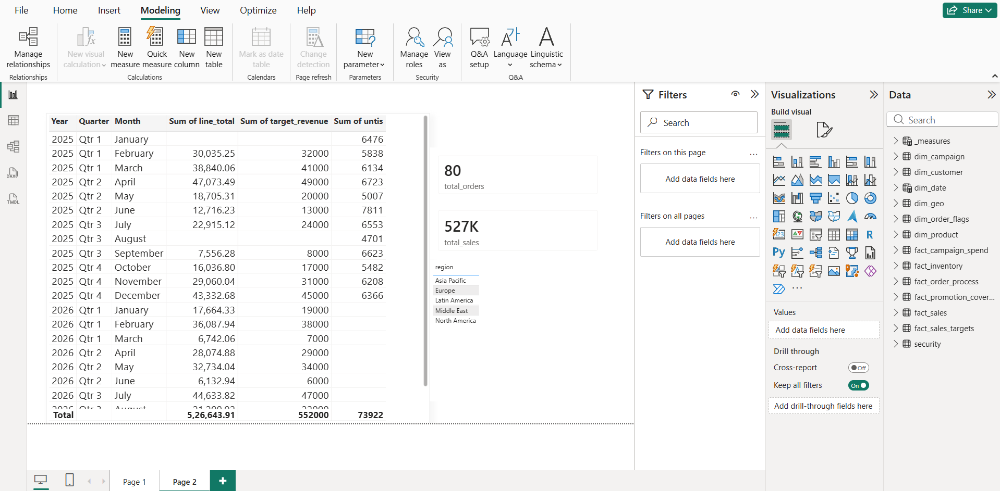
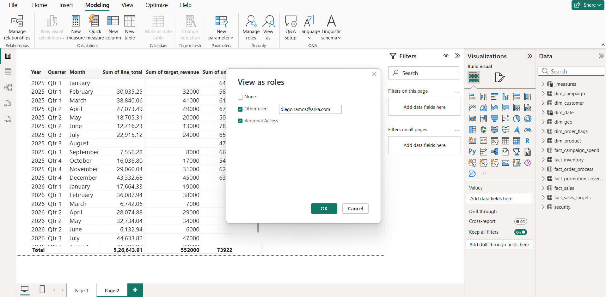
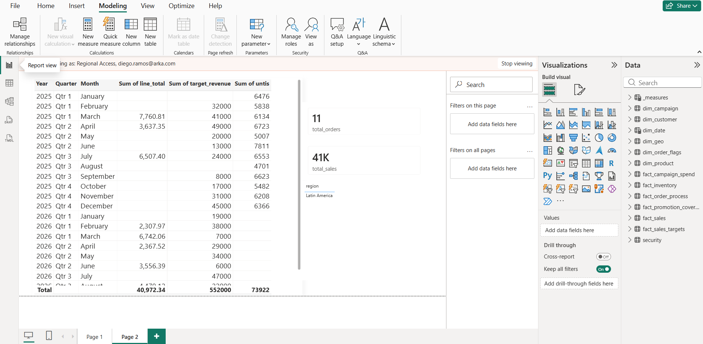
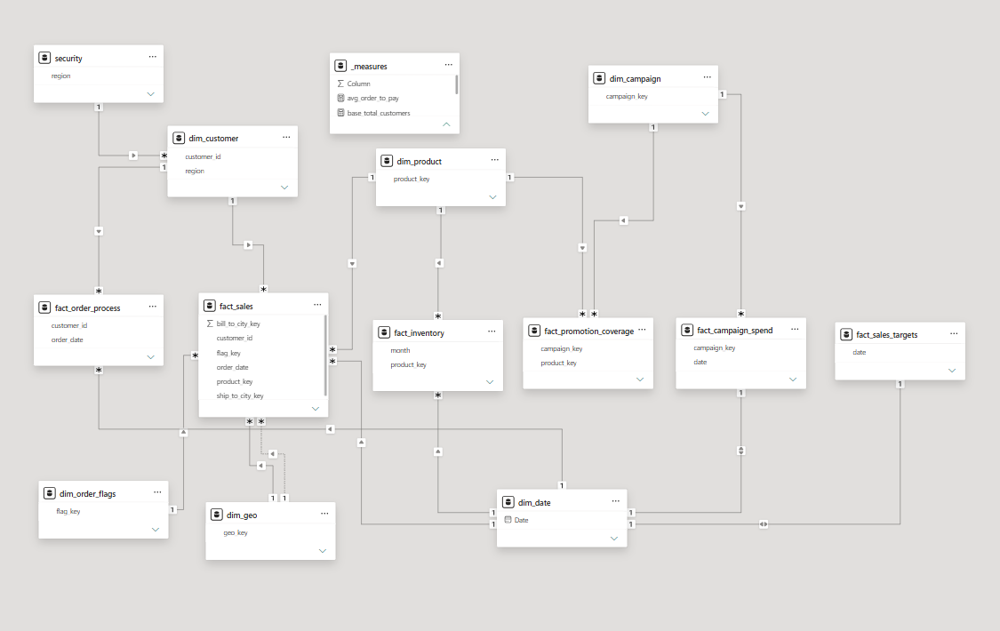

# 📊 Power BI Sales Data Modeling

## Project Overview

This project demonstrates the redesign of a complex sales data model into a clean and scalable Star Schema using Power BI.

Starting with a highly connected dataset containing 23 tables, I transformed the original relational model into an optimized dimensional model consisting of fact and dimension tables. I also implemented Row-Level Security (RLS) to enable secure, role-based access to reports.

## Features

- Star Schema Design
- Fact & Dimension Modeling
- Row-Level Security (RLS)
- Interactive Sales Dashboard
- KPI Cards
- Sales vs Target Analysis
- Regional Filtering
- Time-based Analysis

## Technologies
- Power BI
- Power Query

## Dashboard

### Overall Dashboard

### Dashboard – Sales & KPIs

### Dashboard – Regional Analysis

---

## Data Model

### Star Schema

##  Description

Rebuilt a complex 23-table sales dataset into a clean Star Schema using Power BI by designing optimized fact and dimension tables. Implemented Row-Level Security (RLS), simplified relationships, and developed an interactive dashboard for sales analytics.

